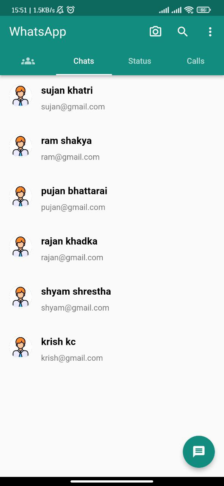
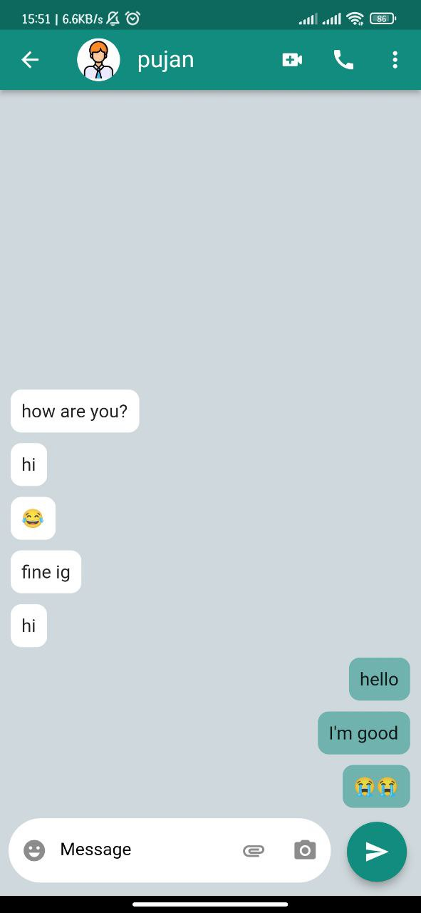
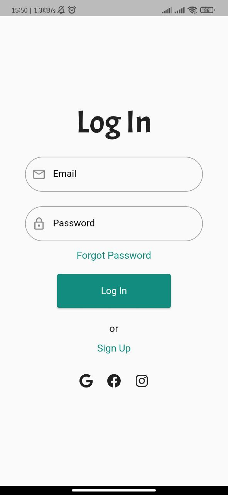
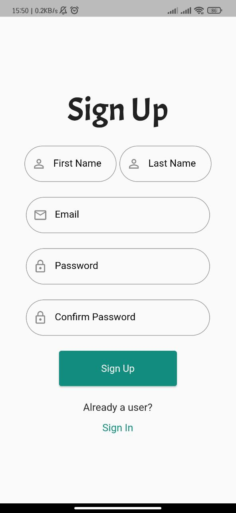

# WhatsApp UI Clone

A Flutter-based application replicating the UI and basic functionalities of WhatsApp. This project, built on the **stacked architecture**, is meant for educational purposes and is not affiliated with the official WhatsApp application.

## Features

- **UI similar to WhatsApp** for an immersive user experience.
- **User Registration & Sign-In**: Users can create an account and sign in securely.
- **Personal Messaging**: Users can chat with other registered users in real time.
- **Firebase Authentication**: Securely handle user registration and sign-in.
- **Firebase Firestore Database**: Store and retrieve chat messages efficiently.
- **Unit Tests**: Tests for Firebase services, including auth and database.

## Screenshots
 





## Getting Started

### Prerequisites

Ensure you have the following installed on your local machine:

- [Flutter SDK](https://flutter.dev/docs/get-started/install)
- A Firebase project with Firestore database set up.

### Installation

1. Clone the repository:
``` git clone https://github.com/PujanB10/whatsapp-stacked-architecture```


2. Navigate to the project directory:
``` cd whatsapp-stacked-architecture ```

3. Install the dependencies:
``` flutter pub get ```

4. Connect your application to Firebase:
   - Navigate to the Firebase console and download your `google-services.json` file.
   - Place it inside the `android/app/` directory.

5. Run the application:
``` flutter run ```


## CI/CD with Codemagic

This project uses Codemagic for Continuous Integration and Continuous Deployment. Builds are automatically pushed to Firebase App Distribution after successful integration by Codemagic.

### Configuration

Make sure you have set up the Codemagic workflow to integrate with Firebase App Distribution. For guidance, refer to the [Codemagic documentation](https://docs.codemagic.io/flutter-publishing/firebase-app-distribution/).


## Running Tests
To run unit tests:
``` flutter test  ```


## TODO List

- [ ] **Group Messaging**: Enable users to create and join group chats.
- [ ] **Image Uploading**: Allow users to send and receive images in chats.
- [ ] **Widget Testing**: Test individual components of the application.
- [ ] **Integration Testing**: Test the application as a whole, ensuring all parts work in tandem.

## Contributing

Pull requests are welcome! For major changes, please open an issue first to discuss what you would like to change.

## License

This project is licensed under the MIT License. See the [LICENSE](LICENSE) file for details.


